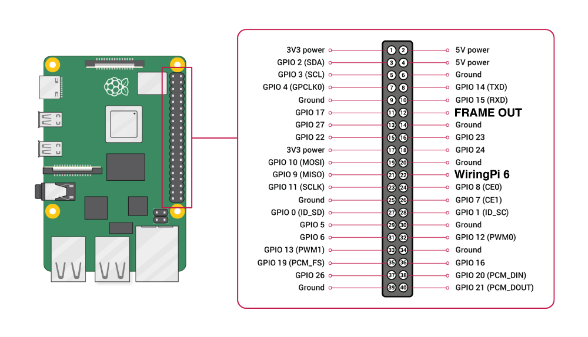

# RPG
## A high performance python library for displaying visual stimuli on the Raspberry Pi 3 and 4.

## Getting Started
If you are unfamiliar with the Raspberry Pi, an excellent starting guide is provided by the Raspberry Pi Foundation [here](https://projects.raspberrypi.org/en/projects/raspberry-pi-getting-started). Once you have gotten the Raspberry Pi started, you have to choose how you will interact with it, either directly through the monitor attached to it, or via secure shell (SSH). We recommend using SSH as it allows the monitor attached to the Raspberry Pi (and used to present stimuli) to be placed in any location. Furthermore, you can send commands to the Raspberry pi even when it is displaying stimuli.  

To access the your Raspberry pi via SSH, you need the Raspberry Pi on your local network (you may have to contact your system administrator for that to happen). Then you need to know your Raspberry Pi's IP address. To find this open a terminal press `ctrl-alt-T`. Then type `ifconfig eth0` and you should see a printout like this:

```
    eth0: flags=4163<UP,BROADCAST,RUNNING,MULTICAST>  mtu 1500
        inet 10.60.22.175  netmask 255.255.255.0  broadcast 10.60.22.255
        inet6 fe80::660d:1bd3:2658:4a5  prefixlen 64  scopeid 0x20<link>
        ether dc:a6:32:26:33:76  txqueuelen 1000  (Ethernet)
        RX packets 12758  bytes 1662297 (1.5 MiB)
        RX errors 0  dropped 0  overruns 0  frame 0
        TX packets 6135  bytes 744970 (727.5 KiB)
        TX errors 0  dropped 0 overruns 0  carrier 0  collisions 0
``` 

The number after `inet` is your IP address (10.60.22.175 in my case). If you are connecting to the LAN via WiFi, this is not your IP address, use the command `ifconfig wlan0` (though you probably know that already).

Now that you know your Raspberry Pi's IP address, you can access it via SSH. On windows, download the program PuTTY (available at [putty.org](https://www.putty.org/) ). If you have an Apple, open Terminal (available under Applications) and type `ssh pi@IP-ADDRESS` where IP-ADDRESS is the IP address we found out earlier, e.g. `ssh pi@10.60.22.175`. In both cases you will then have to enter your password (which is `raspberry` by default). As you type it in, it will NOT come up. Do not worry. If you enter it successfully and press enter, you will now have remote access to your Raspberry Pi.


## Download
Move to your home directory, and clone the repository with this command.

```
    $ cd ~
    $ git clone https://github.com/bill-connelly/rpg
```
    
## Configure
Before installation you need to set the degrees of visual angle your monitor covers. This is a simple edit of a single line of code.

```
    $ cd rpg
    $ nano rpg/_rpigratings.c
```
        
On line 28 the code will say `#define DEGREES_SUBTENDED 80` change the number `80` to however many degrees your monitor covers. Then press `cntrl-x` to exit `y` to save, and press enter to accept file name.

It will be worthwhile to familiarize yourself with the GPIO layout of the Raspberry Pi, especially the location of physical pin 12, which delivers the Frame Out information, and physical pin 22, which is the pin used as the trigger pin in the example documentation, and is known by the WiringPi pin notation 6.


 
## Install

Confirm you are in the rpg directory (i.e. the directory with setup.py) and install. You must run install with sudo.
```
    $ cd ~/rpg
    $ sudo pip3 install .
```
After installing, you should restart the Raspberry Pi. If you are using a Raspberry Pi 4, this is essential.
```
    $ sudo reboot
````

## Run

RPG is designed to run in response to 3.3 volt triggers from other hardware, or in a free running mode, where it will provide a 3.3V output when it displays each frame. There are several examples scripts in the examples folder. But briefly, to confirm that RPG has been install successfully, and to show its functionality, the following lines of code can be run.

We need to leave the graphical user interface, to allow RPG full access to the display. So hit Ctrl + Alt + F1

Then open python

```
    $ python3
```
Then import the module
```    
    >>> import rpg
```
Now we need to make some gratings. These can either be fullscreen, in a circular mask or as gabor patches. In this example, we will create a full screen sine-wave gratings. First we need to create a dictionary to store the parameters we intend to use.
```
    >>> options = {"duration": 2, "angle": 45, "spac_freq": 0.2, "temp_freq": 1}
```
Now we will write the grating to disk, aka, *build* the grating. This grating will have the default resolution of 1280x720, the default bit-depth of 16 bit and the frame rate of your monitors current refresh rate, but many other resolutions, bit depths and frame rates are possible. To build a grating like this, the directory it is being written to must already exist, so we will write it into the home directory.
```
    >>> rpg.build_grating("~/first_grating.dat", options)
```
You will receive some feedback. Despite requesting a temporal frequency of 1 cycle per second (the last option in the dictionary), you may be told that the temporal frequency of the file not quite what was requested. This change was performed in order to optimize file size and memory usuage and because the wavefront must proceed at an integer number of pixels per frame.

Now we will create a Screen object. This object contains the methods to load and display gratings. Using the `with` statement allows us to make sure that the screen object is closed properly even if errors occour. We will use the default resolution of 1280x720. The resolution of the Screen object must match the resolutions of the gratings being displayed.
```
    >>> with rpg.Screen() as myscreen:
```
Now we will load the the grating built earlier. This command returns a grating object.
```
    >>>   grating = myscreen.load_grating("~/first_grating.dat")    
```
Finally, we can display the grating
```
    >>>   myscreen.display_grating(grating)
```
So that block of code, with proper indenting, looks like:
```
    >>> with rpg.Screen() as myscreen:
    >>>   grating = myscreen.load_grating("~/first_grating.dat")
    >>>   myscreen.display_grating(grating)
```
Instead of displaying the grating as soon as possible, it is also possible to specify to wait until a 3.3V trigger signal is received on a GPIO pin. The Raspberry Pi works on 3.3V logic, rather than the 5V TTL logic of most DAQ boards and Arduinos, hence we need to step down the voltage level. This can be achieved with a simple voltage divider, but we recommend using a bidirectional logic shifter such as the [BOB-12009 from SparkFun](http://www.sparkfun.com/products/12009). We use the wiringPi library to control the Raspberry Pi GPIO pins, as as such have chosen to use their default, if somewhat unconventional [numbering system](http://wiringpi.com/pins). WiringPi Pin 1, which is the physical pin 12 on the header, is used to supply feedback, deliving a 2ms long high pulse as the frame is drawn to the monitor (v-sync), hence this pin is is reserved.

This trigger behaviour is generated by specifying a pin that RPG will listen to, and wait until a trigger is received before displaying the grating. The delay between the trigger and the grating being displayed is between 2 ms and 1000/[refresh rate of monitor] + 2 ms. 

In order to specify to listen for a trigger signal on pin 6 (physical pin 22 on header):
```
    >>>   myscreen.display_grating(grating, 6)
```

## More examples

RPG is designed to be flexible, however, we believe most users will find the `build_list_of_gratings()` the most useful way to build gratings and the `Screen.display_gratings_randomly()` or `Screen.display_rand_grating_on_pulse()` methods the most useful way to display them.

RPG allows the user to iteratively build lists of gratings simply by specifying the options dictionary to contain one setting as a list. RPG will then iterate through this list, building gratings that are identical, apart from the parameters specified in this list. For example, if a user wanted to generate circular masked gratings at 12 different orientations, the options dictionary could be specified as
```
   >>>  options = {
        "duration": 2,
        "angle": [0,30,60,90,120,150,180,210,240,270,300,330],
        "spac_freq": 0.2,
        "temp_freq": 1,
        ...
```
Because this is a grating with a circular mask, we also need to specify it's diameter (as percentage of screen width) and position (as percentage of screen width and height):
```
        ...
        "percent_diameter": 30,
        "percent_center_left": 50,
        "percent_center_top": 50
         }
```
Now we pass that option dictionary to the function `build_list_of_gratings()` along with a string representing why type of grating with want (either "grating", "mask" or "gabor"), and the directory we want to build all our gratings in. We intend the user to place gratings to be displace in sequence in the same directory. This way that can be conviently loaded and displayed.
```
    >>> rpg.build_list_of_gratings("mask", "~/gratings/variable_ori/", options)
```
This builds gratings at each of the specified orientations, but matching in all other regards. In this manner, any property that can be specified in the option dictionary can be itterated through.

Now we need to display the gratings. We can use either the `Screen.display_gratings_randomly()` or `Screen.display_rand_grating_on_pulse()` methods to display these gratings iteratively, the first, displaying them at a fixed interval, and the second in response to a 3.3V stimuli to a specific pin.

In order to iterate through gratings in response to a 3.3V trigger to pin 6 (physically pin 22 on header) call
```
    >>> myscreen.display_rand_grating_on_pulse("~/gratings/variable_ori/", 6)
```
The performance record of this will be recorded, by default, in ~/rpg/logs/rpglog.txt. This logfile saves the output in a tab separated file, where each line is a displayed grating. The elements in each row are, filetype ("grating" or "raw"), start time (in unix time), average frame duration (microseconds) and the standard deviation of the frames displayed (microseconds)

## Raws

RPG is capable of displaying images and movies with the same temporal accuracy as the gratings. However, in order for these to be loaded and played efficiently, the must be converted into a format suitable for RPG. Furthermore, because of the vast number of image and movie formats available, we decided that it is the users responsibility to get the code into a raw format first.

Specifically, the file must be saved pixelwise from the top left pixel, proceeding row-wise, with each pixel saved as (uint8) R, (uint8) G, (uint8) B.... until the final bottom right pixel. If the file contains more than one frame, i.e. it is a movie, then the subsequent byte saves is the red value of the top left pixel of the second frame. We have included some examples of how to process videos and images in the examples folders.

Once a raw file is produced to the above specification, it can be converted to a format suitable for RPG to play with the function `convert_raw`. Specifically, if a raw 30 FPS movie at 1024x768 resolution with 200 frames is saved in "\~/import/rawmovie.raw" it can be converted and saved to "\~/raws/raw_c.raw" with the following
```
    >>> convert_raw("~/import/rawmovie.raw", "~/raws/raw_c.raw", 200, 1024, 768, 2)
```
The last argument is the number of monitor refreshes per frame. Specifically, in order to maintain accurate and reproducible timings, typical movie frame rates of 29.97 or 25 cannot be specified directly. Instead, an integer multiple of the duration of a monitor refresh rate is specified. Thus, in order to achieve 30 FPS, the monitor refresh rate should be set to 60, and the final argument should be 2. In order to achieve 25 FPS the monitor refresh rate should be set to 50 Hz, and the final argument 2, or the monitor set to 100 Hz, and the final argument 4.

The second argument, the number of frames, should not be used to clip movies. The entire movie will be converted if this number is set to less than the duration of the movie on disk, however, only the specified number of frames will be played.

Movies can take up significant amounts of memory, e.g. a 400 frame, 1024x768 movie will take 16*1024*768*400 bits or 629 MB, which is practically the entirety of the free memory on a Raspberry Pi 3. This means large numbers of  movies cannot be stored in RAM simultaneously. This should be considered when designing experiments.

Images can be converted just the same as movies, except one specifies the number of frames as 1, and the last argument as the duration the image should be displayed in monitor refreshes, e.g. if an image is to be displayed for 1.5 seconds, on a 60 Hz monitor, this argument should be entered as 90.

If a raw image is saved in "~/images/1_c.raw" it can be loaded into memory with:
```
    >>> raw = myscreen.load_raw("~/images/1_c.raw")
```
This can then be displayed with:
```
    >>> myscreen.display_raw(raw)
```
In a similar fashion to drifting gratings, raws can also be displayed in response to a 3.3V pulse by specifying the pin number:
```
    >>> myscreen.display_raw(raw, 6)
``` 
Likewise, analogous functions to `display_grating_randomly()` and `display_rand_grating_on_pulse()` exist for raws. You can randomly select raws from a directory, and display them with an intertrial time of 2 seconds:
```
    >>> myscreen.display_raw_randomly("/~/raw_directory/, 2)
```
Or you can display a random raw from a directory in response to a 3.3V pulse with:
```
    >>> myscreen.display_rand_raw_on_pulse("/~/raw_directory", 6)
```


Tested on Raspian GNU/Linux 8, Python 3.4.2.

## Troubleshooting
STATIONARY GRATINGS
    Low resolution combined with low propagation speeds (low temporal frequency or
    high spacial frequency) and high FPS may result in unmoving gratings, because the
    per-frame propagation speed is rounded to the nearest integer number of pixels
    (such that propagation is even each frame), and this speed may be rounded down to zero.

MEMORY MANAGEMENT
    The Raspberry Pi 3 has 1GB of memory, of which typically 750MB is free. Each 1280 x 720
    frame of 16 bit data takes up 14.75MB of ram. A typical 1 seconds grating with no looped
    frames at 60 Hz therefore takes up 110.6MB. Hence a maximum number of *unlooped* gratings
    that can be stored is less than 7. However, RPG attempts to make gratings loop, which is 
    achievable at high temporal frequencies, e.g. a 1 second grating at 2 cycles per second 
    only requires half the frames, as the second cycle is identical to the first. However, gratings
    where the temporal frequency is less than the duration will require every frame within it 
    generated, and stored to memory. This may lead to crashes if many of these are loaded at once.

DUAL MONITORS
    The Raspberry Pi 4 has physical support for dual monitors. However, RPG offers no explict
    support for dual monitors. Behaviour with dual monitors is completely untested and likely
    to fail. If you want to use two monitors, use two Raspberry Pis running independently. This
    with insure all timing pulses are as accurate as can be.
